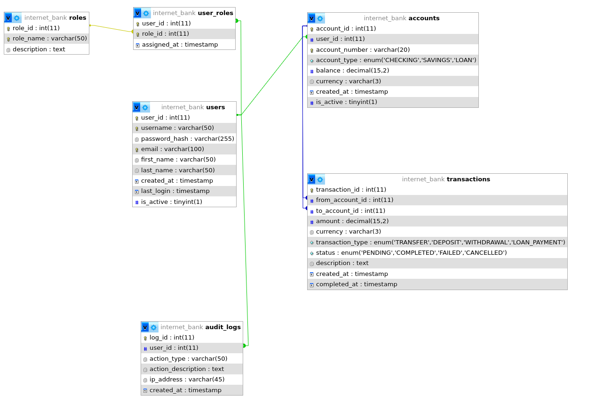
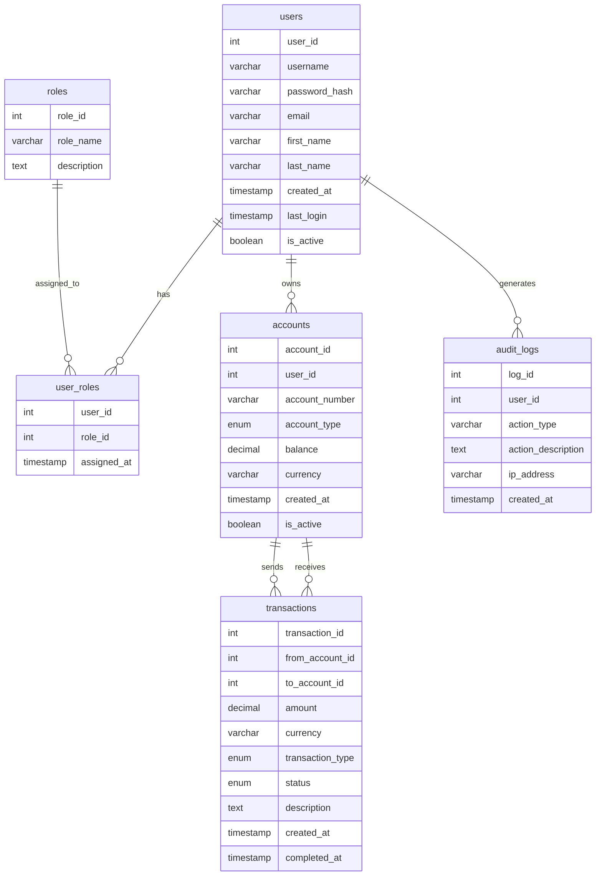

# Internetipanga Andmebaasi Dokumentatsioon

## Lühikirjeldus ja eesmärk

Käesolev dokumentatsioon kirjeldab internetipanga rakenduse jaoks loodud relatsioonilise andmebaasi struktuuri, projekteerimise põhimõtteid ja tehnilisi lahendusi. Andmebaasi eesmärk on hallata kasutajakontosid, kontosid, tehinguid ja logisid, et veebirakendus saaks teha turvalisi ja jälgitavaid rahaülekandeid ning pakkuda kasutajatele mugavat ja turvalist teenust.

Andmebaas on tihedalt seotud internetipanga veebirakendusega, mis kasutab REST API-t andmete pärimiseks ja muutmiseks. Kõik olulised tegevused (nt sisselogimised, rahaülekanded) logitakse auditlogidesse, et tagada süsteemi turvalisus ja läbipaistvus.

Dokument sisaldab:
- Andmebaasi eesmärgi ja seotuse kirjeldust
- Tabelite ja väljade täielikku loetelu koos SQL-näidetega
- ER-diagrammi ja andmevoogude skeeme
- Õiguste halduse, eksportimise ja importimise juhiseid
- Näiteid andmete sisestamiseks, muutmiseks ja kustutamiseks
- Transaktsioonide kasutamise näiteid
- Kokkuvõtet õppetundidest ja väljakutsetest

---

# Andmebaasi Kujundamise Metoodika

## Kasutatud Metoodikad

### 1. ER-Mudel (Entity-Relationship Model)

Andmebaasi kujundamisel kasutasin ER-mudelit (Entity-Relationship Model), mis on üks levinumaid andmemudeli kujundamise metoodikaid. ER-mudel võimaldab visuaalselt kujutada:

- Olemid (Entities) - näiteks kasutajad, kontod, tehingud
- Olemitevahelised seosed (Relationships) - näiteks kasutaja-konto seos
- Olemite atribuudid (Attributes) - näiteks kasutaja eesnimi, perekonnanimi

### 2. Normaliseerimine

Andmebaasi struktuur on normaliseeritud vastavalt 3. normaalkujule (3NF):

- 1NF: Kõik andmed on aatomilised (ei ole korduvaid gruppe)
- 2NF: Kõik mittevõtme atribuudid sõltuvad täielikult primaarvõtmest
- 3NF: Kõik mittevõtme atribuudid sõltuvad ainult primaarvõtmest

Näiteks:

- Kasutajate andmed on eraldatud omaette tabelisse
- Rollid on eraldatud omaette tabelisse
- Kasutaja-rolli seosed on eraldatud omaette tabelisse

### 3. UML Klassidiagramm

Algne andmemudel põhines UML klassidiagrammil, mis hiljem teisendati ER-mudeliks. UML klassidiagramm aitas:

- Määratleda klasside (tabelite) struktuuri
- Defineerida klassidevahelised seosed
- Määrata atribuutide tüübid ja piirangud

### 4. Andmevoogude Analüüs

Andmebaasi kujundamisel analüüsisin:

- Andmevooge (näiteks rahaülekannete protsess)
- Kasutajate rollisid ja õigusi
- Auditimise vajadusi
- Tehingute ajaloolist jälgimist

## Rakendatud Põhimõtted

1. **Andmeterviklus**
   - Võõrvõtmed tagavad andmetervikluse
   - Kaskadne kustutamine (ON DELETE CASCADE) võimaldab automaatset andmete puhastamist
   - UNIQUE piirangud vältivad duplikaate

2. **Jõudlus**
   - Indeksid on loodud sagedasti päritavatele väljadele
   - Optimeeritud andmetüübid (näiteks DECIMAL rahasummade jaoks)
   - Efektiivne seoste struktuur

3. **Turvalisus**
   - Paroolide räsimine
   - Rollipõhine ligipääs
   - Auditlogide pidamine

4. **Skaleeritavus**
   - Modulaarne struktuur
   - Võimalus lisada uusi funktsioone
   - Lihtne laiendatavus

## Järeldused

Andmebaasi kujundamisel on edukalt kombineeritud:

- ER-mudeli visuaalne kujutamine
- UML klassidiagrammide loogiline struktuur
- Normaliseerimise põhimõtted
- Andmevoogude analüüs

See on taganud:

- Selge ja loogilise andmebaasi struktuuri
- Efektiivse andmete halduse
- Lihtsa laiendatavuse
- Hea jõudluse
- Turvalise andmekäsitluse

## Planeerimise ja kujundamise dokumentatsioon

Andmebaasi projekteerimise protsessis:
- Analüüsiti ärinõudeid (internetipanga funktsionaalsus, turvalisus, audit)
- Koostati UML klassidiagramm, mille põhjal loodi ER-diagramm
- ER-diagrammi põhjal loodi SQL-andmebaasi struktuur
- Normaliseeriti tabelid (vältimaks andmete dubleerimist ja tagamaks andmeterviklust)
- Määrati võtmed ja seosed (primaarvõtmed, võõrvõtmed, unikaalsed väljad)
- Lisati indeksid jõudluse parandamiseks
- Kavandati õiguste haldus ja auditlogid

Kõik need sammud on dokumenteeritud ja visualiseeritud nii tekstina kui ka diagrammidena, et tagada selgus ja läbipaistvus andmebaasi projekteerimisel.

## Tabelite ja väljade valiku põhjendus

Tabelite ja väljade valik lähtus internetipanga projekti funktsionaalsetest ja turvanõuetest:

- **Kasutajad (users):** Iga internetipanga kasutaja kohta on eraldi kirje, mis sisaldab olulisi isikuandmeid (nimi, e-post), autentimiseks vajalikku infot (kasutajanimi, parooli räsi) ning staatust ja loomise aega. See võimaldab hallata kasutajate ligipääsu ja jälgida nende tegevust.
- **Rollid (roles) ja kasutaja-rollid (user_roles):** Rollide süsteem võimaldab määrata erinevaid õiguseid (nt admin, tavaline kasutaja, audiitor). Kasutaja ja rolli vaheline seos on realiseeritud eraldi tabelina, et üks kasutaja saaks omada mitut rolli ja üks roll kuuluda mitmele kasutajale.
- **Kontod (accounts):** Igal kasutajal võib olla mitu kontot (nt arveldus- ja säästukonto). Konto tabelis on info konto numbri, tüübi, valuuta, saldo ja staatuse kohta. See võimaldab hallata erinevaid kontotüüpe ja jälgida nende seisu.
- **Tehingud (transactions):** Kõik rahaülekanded ja muud tehingud salvestatakse eraldi tabelisse, kus iga kirje sisaldab infot alg- ja sihtkonto, summa, valuuta, tüübi, staatuse ja kirjelduse kohta. See võimaldab jälgida kõiki liikumisi ning tagada tehingute läbipaistvus ja auditeeritavus.
- **Auditlogid (audit_logs):** Turvalisuse ja jälgitavuse tagamiseks logitakse kõik olulised tegevused (nt sisselogimised, rahaülekanded, muudatused) koos kasutaja, tegevuse tüübi, kirjelduse, IP-aadressi ja ajamärgiga.

Väljade valikul lähtuti järgmistest põhimõtetest:
- Igal tabelil on primaarvõti (ID), mis tagab unikaalsuse ja võimaldab seoseid teiste tabelitega.
- Kasutatud on sobivaid andmetüüpe (nt DECIMAL rahasummade jaoks, VARCHAR tekstiliste väärtuste jaoks, ENUM tüübi piiramiseks).
- Lisatud on väljad, mis võimaldavad jälgida kirje loomise ja muutmise aega (nt created_at).
- Seosed (võõrvõtmed) on määratud vastavalt äriloogikale: nt igal kontol on omanik (user_id), igal tehingul on alg- ja sihtkonto (from_account_id, to_account_id).

Näiteks:  
"Väljade valik ja seosed lähtuvad funktsionaalsusest, kus kasutajal on mitu kontot ja igal kontol mitu tehingut. Lisaks on oluline logida kõik olulised tegevused ning võimaldada rollipõhist ligipääsu, mistõttu on loodud eraldi rollide ja auditlogide tabelid."

## Tabelite loomine

Allpool on toodud kõikide andmebaasi tabelite loomisel kasutatud SQL-laused koos väljade ja võtmetega:

```sql
-- Kasutajad (users)
CREATE TABLE users (
    user_id INT PRIMARY KEY AUTO_INCREMENT,
    username VARCHAR(50) NOT NULL UNIQUE,
    password_hash VARCHAR(255) NOT NULL,
    email VARCHAR(100) NOT NULL UNIQUE,
    first_name VARCHAR(50) NOT NULL,
    last_name VARCHAR(50) NOT NULL,
    created_at TIMESTAMP DEFAULT CURRENT_TIMESTAMP,
    last_login TIMESTAMP NULL,
    is_active BOOLEAN DEFAULT TRUE
);

-- Rollid (roles)
CREATE TABLE roles (
    role_id INT PRIMARY KEY AUTO_INCREMENT,
    role_name VARCHAR(50) NOT NULL UNIQUE,
    description TEXT
);

-- Kasutaja-rollid (user_roles)
CREATE TABLE user_roles (
    user_id INT,
    role_id INT,
    assigned_at TIMESTAMP DEFAULT CURRENT_TIMESTAMP,
    PRIMARY KEY (user_id, role_id),
    FOREIGN KEY (user_id) REFERENCES users(user_id) ON DELETE CASCADE,
    FOREIGN KEY (role_id) REFERENCES roles(role_id) ON DELETE CASCADE
);

-- Kontod (accounts)
CREATE TABLE accounts (
    account_id INT PRIMARY KEY AUTO_INCREMENT,
    user_id INT NOT NULL,
    account_number VARCHAR(20) NOT NULL UNIQUE,
    account_type ENUM('CHECKING', 'SAVINGS', 'LOAN') NOT NULL,
    balance DECIMAL(15,2) DEFAULT 0.00,
    currency VARCHAR(3) DEFAULT 'EUR',
    created_at TIMESTAMP DEFAULT CURRENT_TIMESTAMP,
    is_active BOOLEAN DEFAULT TRUE,
    FOREIGN KEY (user_id) REFERENCES users(user_id) ON DELETE CASCADE
);

-- Tehingud (transactions)
CREATE TABLE transactions (
    transaction_id INT PRIMARY KEY AUTO_INCREMENT,
    from_account_id INT,
    to_account_id INT,
    amount DECIMAL(15,2) NOT NULL,
    currency VARCHAR(3) DEFAULT 'EUR',
    transaction_type ENUM('TRANSFER', 'DEPOSIT', 'WITHDRAWAL', 'LOAN_PAYMENT') NOT NULL,
    status ENUM('PENDING', 'COMPLETED', 'FAILED', 'CANCELLED') DEFAULT 'PENDING',
    description TEXT,
    created_at TIMESTAMP DEFAULT CURRENT_TIMESTAMP,
    completed_at TIMESTAMP NULL,
    FOREIGN KEY (from_account_id) REFERENCES accounts(account_id) ON DELETE SET NULL,
    FOREIGN KEY (to_account_id) REFERENCES accounts(account_id) ON DELETE SET NULL
);

-- Auditlogid (audit_logs)
CREATE TABLE audit_logs (
    log_id INT PRIMARY KEY AUTO_INCREMENT,
    user_id INT,
    action_type VARCHAR(50) NOT NULL,
    action_description TEXT,
    ip_address VARCHAR(45),
    created_at TIMESTAMP DEFAULT CURRENT_TIMESTAMP,
    FOREIGN KEY (user_id) REFERENCES users(user_id) ON DELETE SET NULL
);
```

## Näidis SQL-laused: andmete sisestamine, muutmine ja kustutamine

Allpool on toodud näited, kuidas sisestada, muuta ja kustutada andmeid erinevates tabelites:

```sql
-- Näide: kasutaja lisamine
INSERT INTO users (username, password_hash, email, first_name, last_name)
VALUES ('mari', '$2a$10$example_hash', 'mari@naide.ee', 'Mari', 'Maasikas');

-- Näide: rolli lisamine
INSERT INTO roles (role_name, description)
VALUES ('MANAGER', 'Kliendihaldur');

-- Näide: kasutajale rolli määramine
INSERT INTO user_roles (user_id, role_id)
VALUES (1, 2);

-- Näide: konto lisamine
INSERT INTO accounts (user_id, account_number, account_type, balance)
VALUES (1, 'EE123456789012345678', 'CHECKING', 1000.00);

-- Näide: tehingu lisamine
INSERT INTO transactions (from_account_id, to_account_id, amount, transaction_type, status, description)
VALUES (1, 2, 50.00, 'TRANSFER', 'COMPLETED', 'Ülekanne sõbrale');

-- Näide: auditlogi lisamine
INSERT INTO audit_logs (user_id, action_type, action_description, ip_address)
VALUES (1, 'LOGIN', 'Kasutaja logis sisse', '192.168.1.1');

-- Näide: kasutaja andmete muutmine
UPDATE users
SET email = 'mari.uus@naide.ee', last_login = NOW()
WHERE user_id = 1;

-- Näide: konto saldo muutmine
UPDATE accounts
SET balance = balance + 100.00
WHERE account_id = 1;

-- Näide: kasutaja kustutamine
DELETE FROM users
WHERE user_id = 1;

-- Näide: tehingu kustutamine
DELETE FROM transactions
WHERE transaction_id = 10;
```

## Transaktsioonide kasutamine (BEGIN/COMMIT/ROLLBACK)

Andmebaasis kasutatakse transaktsioone, et tagada andmete terviklikkus keerukamate toimingute (nt rahaülekanded) puhul. Allpool on näide, kuidas rahaülekanne kahe konto vahel toimub ühe transaktsioonina:

```sql
-- Rahaülekanne kahe konto vahel (transaktsiooniga)
BEGIN;

    -- Vähenda saatja konto saldot
    UPDATE accounts
    SET balance = balance - 100.00
    WHERE account_id = 1;

    -- Suurenda saaja konto saldot
    UPDATE accounts
    SET balance = balance + 100.00
    WHERE account_id = 2;

    -- Lisa tehingute tabelisse uus kirje
    INSERT INTO transactions (from_account_id, to_account_id, amount, transaction_type, status, description)
    VALUES (1, 2, 100.00, 'TRANSFER', 'COMPLETED', 'Ülekanne Mari kontole');

    -- Logi tegevus auditlogi
    INSERT INTO audit_logs (user_id, action_type, action_description, ip_address)
    VALUES (1, 'TRANSFER', 'Ülekanne kontolt 1 kontole 2', '192.168.1.1');

COMMIT;
```

Kui mõni samm ebaõnnestub (näiteks kui saatja kontol pole piisavalt raha), saab kogu tehingu tagasi pöörata:

```sql
ROLLBACK;
```

Selline lähenemine tagab, et kõik seotud muudatused tehakse kas täielikult või mitte üldse, vältides andmete vastuolusid.

## Õiguste haldus, eksport ja import

Andmebaasile on loodud erinevad kasutajad ning neile on määratud sobivad õigused vastavalt rollile ja turvanõuetele.

### Kasutajate loomine ja õiguste jagamine

```sql
-- Rakenduse kasutaja (ainult lugemine ja kirjutamine)
CREATE USER 'app_user'@'localhost' IDENTIFIED BY 'secure_password';
GRANT SELECT, INSERT, UPDATE ON internet_bank.* TO 'app_user'@'localhost';

-- Administraator (täisõigused)
CREATE USER 'admin_user'@'localhost' IDENTIFIED BY 'admin_secure_password';
GRANT ALL PRIVILEGES ON internet_bank.* TO 'admin_user'@'localhost';

-- Audiitor (ainult lugemisõigus)
CREATE USER 'auditor_user'@'localhost' IDENTIFIED BY 'auditor_secure_password';
GRANT SELECT ON internet_bank.* TO 'auditor_user'@'localhost';
```

Õiguste jagamisel lähtuti põhimõttest, et igal kasutajal on ainult tema tööks vajalikud õigused (least privilege):
- **app_user** – saab andmeid lugeda, lisada ja muuta, kuid mitte kustutada ega muuta struktuuri.
- **admin_user** – saab teha kõiki toiminguid, sh struktuurimuudatused ja kasutajahaldus.
- **auditor_user** – saab ainult andmeid lugeda, ei saa midagi muuta ega lisada.

### Andmete eksport ja import (varukoopiad)

Andmebaasi saab hõlpsasti varundada ja taastada järgmiste käskudega:

**Eksport (varukoopia loomine):**
```bash
mysqldump -u root -p internet_bank > varukoopia.sql
```

**Import (varukoopiast taastamine):**
```bash
mysql -u root -p internet_bank < varukoopia.sql
```

Näiteks, kui soovid teha kuupäevaga varukoopia:
```bash
mysqldump -u root -p internet_bank > backup_$(date +%Y%m%d).sql
```
ja taastada selle:
```bash
mysql -u root -p internet_bank < backup_20240508.sql
```

## Seotus veebirakendusega

Loodud andmebaas on tihedalt seotud internetipanga veebirakendusega, mis suhtleb andmebaasiga läbi REST API päringute. Rakendus kasutab järgmisi tüüpilisi päringuid ja andmevahetusi:

- **Kasutajate autentimine:**  
  - POST /login – kontrollib kasutajanime ja parooli, kasutades andmebaasi päringut tabelist `users`.

- **Kontode haldus ja päringud:**  
  - GET /accounts – tagastab sisseloginud kasutaja kõik kontod (päring tabelist `accounts`).
  - GET /accounts/{id} – tagastab konkreetse konto detailid.
  - POST /accounts – loob uue konto (sisestab uue rea tabelisse `accounts`).

- **Tehingud:**  
  - GET /transactions – tagastab kasutaja kontodega seotud tehingud (päring tabelist `transactions`).
  - POST /transactions – lisab uue tehingu (sisestab uue rea tabelisse `transactions` ja uuendab kontode saldosid).

- **Auditlogid:**  
  - GET /audit-logs – administraator või audiitor saab vaadata süsteemi tegevuslogisid (päring tabelist `audit_logs`).

Andmevahetus toimub JSON formaadis. Näiteks uue tehingu lisamisel saadab rakendus järgmise päringu:
```http
POST /transactions
Content-Type: application/json

{
  "from_account_id": 1,
  "to_account_id": 2,
  "amount": 100.00,
  "description": "Ülekanne Mari kontole"
}
```

Kõik olulised tegevused (nt sisselogimine, rahaülekanne) logitakse automaatselt auditlogidesse. REST API tagab, et andmebaasi pääseb ligi ainult turvaliste ja kontrollitud päringute kaudu.

### Näide: kontodevaheline ülekanne rakenduses ja selle kajastumine andmebaasis

Kui kasutaja teeb veebirakenduses kontodevahelise ülekande (nt kannab kontolt nr 1 kontole nr 2 summa 100), toimub järgmine protsess:

1. **Kasutaja esitab päringu:**
   ```http
   POST /transactions
   Content-Type: application/json

   {
     "from_account_id": 1,
     "to_account_id": 2,
     "amount": 100.00,
     "description": "Ülekanne Mari kontole"
   }
   ```
2. **Rakendus kontrollib, kas saatja kontol on piisavalt raha.**
3. **Kui tingimus on täidetud, käivitatakse SQL-transaktsioon:**
   - Saatja konto saldo väheneb 100 võrra.
   - Saaja konto saldo suureneb 100 võrra.
   - Tabelisse `transactions` lisatakse uus rida.
   - Tabelisse `audit_logs` lisatakse logikirje.
4. **Kui mõni samm ebaõnnestub (nt pole piisavalt raha), tehakse ROLLBACK ja andmeid ei muudeta.**

See tagab, et kõik seotud muudatused jõuavad andmebaasi ainult siis, kui kogu protsess õnnestub, ning kõik tegevused on auditeeritavad.

## Andmebaasi projekteerimine

Andmebaasi projekteerimise protsess algas ärinõuete analüüsiga, mille põhjal kaardistati vajalikud funktsionaalsused (kasutajad, kontod, tehingud, rollid, auditlogid). Esmalt koostati UML klassidiagramm, mis aitas selgelt määratleda süsteemi põhiklassid ja nende omavahelised seosed.

Järgmisena loodi ER-diagramm, mis visualiseerib tabelite struktuuri ja seoseid. Allpool on ER-diagrammi joonis:



Lisaks on kogu ER-mudel esitatud ka tekstiliselt Mermaid süntaksina, mida saab vaadata otse dokumentatsioonis või [Mermaid Live Editoris](https://mermaid.live):



Projekteerimise käigus pöörati tähelepanu andmete normaliseerimisele, võtmete ja seoste määramisele ning andmetervikluse tagamisele. Lisaks kavandati andmevood (nt rahaülekande protsess), õiguste haldus ja auditlogide pidamine, et tagada süsteemi turvalisus ja jälgitavus.

## Kokkuvõte ja õppetunnid

Selle projekti käigus õppisin, kui oluline on andmemudeli põhjalik analüüs ja normaliseerimine, et tagada andmete terviklikkus ja süsteemi laiendatavus. Suurimaks väljakutseks osutus erinevate seoste ja õiguste halduse korrektne modelleerimine, eriti rollipõhise ligipääsu ja auditlogide puhul.

Tagantjärele vaadates teeksin varajases faasis veelgi põhjalikuma ärinõuete analüüsi ning kaasaksin rohkem kasutusstsenaariume, et vältida hilisemaid muudatusi andmemudelis. Samuti pööraksin rohkem tähelepanu jõudluse optimeerimisele suurte andmemahtude korral (nt täiendavad indeksid, arhiveerimislahendused).

Kokkuvõttes valmis terviklik ja turvaline andmebaasilahendus, mis toetab internetipanga põhifunktsioone ning on hästi dokumenteeritud ja laiendatav.

---
